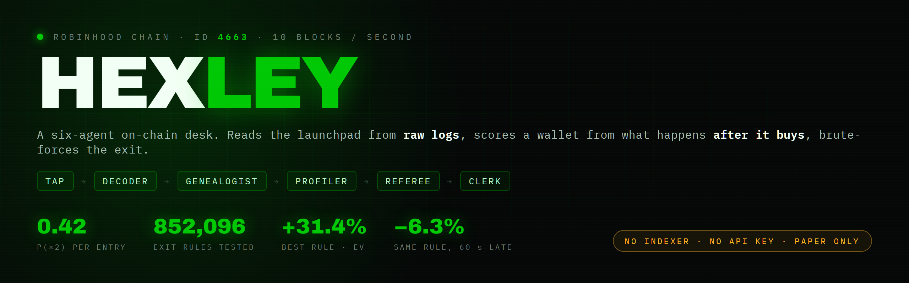
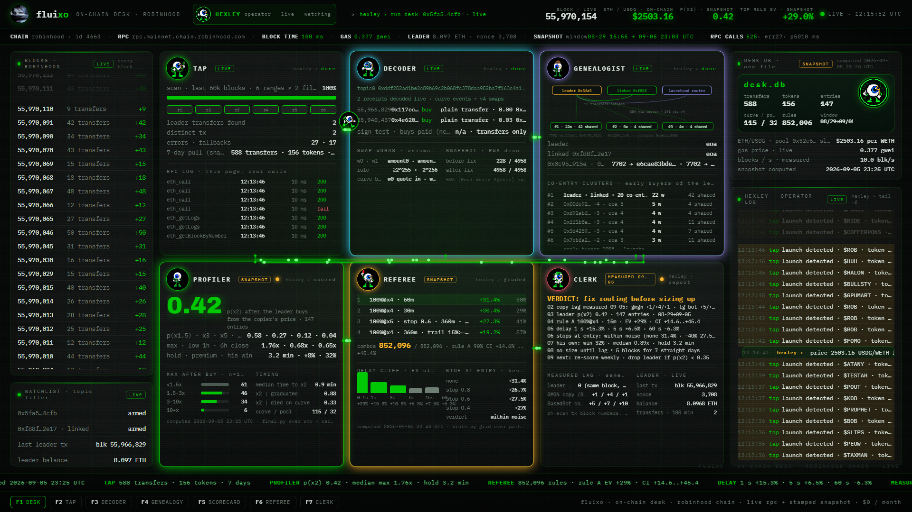

<div align="center">



[](pyproject.toml)
[](LICENSE)
[](docs/robinhood-chain-notes.md)
[](DISCLAIMER.md)

**[Live desk](https://hexley.xyz)** · [Methodology](docs/methodology.md) · [Architecture](ARCHITECTURE.md) · [Agents](docs/agents/README.md)

</div>

**HEXLEY** is the operator: a six-agent on-chain desk for **Robinhood Chain**. The Python package is `chaindesk`, the browser dashboard in `dashboard/` is hexley itself.
It reads the launchpad straight from raw logs, scores a wallet from what happens to price after it buys, brute-forces exit rules on those paths, and tells you whether your copy route is fast enough to matter.

No indexer. No news feed. No API key. One public RPC and a few thousand `eth_getLogs`.

**Paper only.** Nothing here sends a transaction.

```
tap -> decoder -> genealogist -> profiler -> referee -> clerk
```

| seat | job | live? |
|---|---|---|
| **TAP** | streams blocks, finds token births (`Transfer(0x0 -> curve)` of exactly 1e27), curve buys, wallet transfers | live |
| **DECODER** | receipts to signed amounts: curve BUY/SELL words, Uniswap v4 int128 swaps, quote token from the same tx | live |
| **GENEALOGIST** | clusters wallets that enter the same launches within 30 blocks on 4+ launches (union-find, bundlers excluded) | batch |
| **PROFILER** | per-entry price paths from the *copier's* fill, scorecard: p(x2), median max, low 1h, close 6h, copier premium | batch |
| **REFEREE** | vectorized grid over take-profit / stop / time-stop / trail, delay cliff, bootstrap CI | batch |
| **CLERK** | markdown report, JSON snapshot, one-line verdict about routing | both |

## Quick start

```bash
pip install -e ".[dev]"
chaindesk doctor            # chain id 4663, block time, ETH/USDG from pool slot0
chaindesk launches --last 2000
chaindesk watch --blocks 600 --leader 0x5fa57fcaf86e137cb8185c4cb2c01ea7b5b14cfb
```

`doctor` on 2026-09-06:

```
rpc        https://rpc.mainnet.chain.robinhood.com
chain id   4663 ok
head       55,980,055
block time 101 ms (last 1000 blocks)
eth/usdg   2,502.60 (pool 0x52e65b17… slot0)
latency    p50 236 ms over 6 calls
```

`watch` backfills the last 900 blocks, then streams. Every launch gets a row: buys in the first 60 blocks, distinct buyers, volume in the real quote token, crowd hits, score, verdict.

```
FIRE   a crowd wallet bought, or >= 12 buys and >= 8 buyers inside 60 blocks
WATCH  >= 6 buys inside 60 blocks
PASS   otherwise · closed after 300 blocks unless it fired
```

## The live dashboard

[`dashboard/index.html`](dashboard/index.html) is the same desk in a browser: no build step, no server, talks to the public RPC directly (CORS is open). Open the file, watch the block stream, the launch radar, the six seats and the operator log fill from the chain. Snapshot panels carry a `computed_at` stamp so nobody mistakes a backtest for a live number.



## What the numbers say (one leader, one week)

Wallet `0x5fa5…4cfb`, window 2026-08-29 15:55 to 2026-09-05 23:03 UTC, 588 transfers, 156 tokens, 147 entries scored. Full method in [docs/methodology.md](docs/methodology.md), full table in [docs/results/2026-09-05-leader-scorecard.md](docs/results/2026-09-05-leader-scorecard.md).

| metric | value |
|---|---|
| p(x1.5) · p(x2) · p(x3) · p(x5) | 0.58 · 0.42 · 0.27 · 0.12 |
| median max after copier entry | 1.76x |
| median low, first hour | 0.68x |
| median close, 6 h | 0.65x |
| copier premium | 1.08 |
| his own win rate · median realized | 32% · 0.89x |

The leader himself loses on 68% of his trades. The copier's edge, if any, is in the exit rule, not in the entry.

Best rule by EV out of 852,096 combinations: sell 100% at x4, time stop 60 min, **+31.4% per entry**, win rate 30%. Bootstrap 90% CI on the 15-minute variant: +14.6% to +45.4%.

The delay cliff is the whole story:

| entry delay | EV of the same rule |
|---|---|
| 0.1 s (same block) | +29.0% |
| 1 s | +15.3% |
| 3 s | +10.5% |
| 5 s | +6.5% |
| 15 s | +7.6% |
| 60 s | -6.3% |

Measured copy lag on real routes, same launches, 2026-09-05: a GMGN copier landed +1 / +4 / +1 blocks behind, a Telegram bot user +5 / +7 / +10. At 100 ms blocks that is 0.1 to 1 second. Verdict from the clerk: *fix routing before sizing up*.

## Layout

```
chaindesk/
  constants.py      topics, addresses, decimals, limits (all read off the chain)
  rpc.py            JSON-RPC client: getLogs range splitting, 10k limit, archive errors, fallback policy
  decode.py         pure hex -> numbers, fully unit tested
  desk.py           orchestrator: backfill + stream + verdicts
  cli.py            doctor · watch · launches · wallet · price · referee · profile · cluster · report
  agents/           tap · decoder · genealogist · profiler · referee · clerk
dashboard/          browser desk (single html, live RPC)
data/               real snapshots used in the docs
docs/               one file per agent, chain notes, methodology, results
tests/              27 offline tests, no network
```

## Docs

- [ARCHITECTURE.md](ARCHITECTURE.md) how the seats pass work to each other
- [docs/robinhood-chain-notes.md](docs/robinhood-chain-notes.md) block time, sequencer, RPC limits, 7702 wallets, bundlers
- [docs/launchpad-mechanics.md](docs/launchpad-mechanics.md) how a launch looks in raw logs, curve events, graduation to v4
- [docs/methodology.md](docs/methodology.md) how paths, scorecards, rule grids and the delay cliff are built
- [docs/agents/](docs/agents/) one page per seat
- [docs/results/](docs/results/) dated results, never overwritten
- [DISCLAIMER.md](DISCLAIMER.md) read it

## Contributing

`make test` and `make lint` must pass. See [CONTRIBUTING.md](CONTRIBUTING.md). Issues with a block number and a tx hash get fixed first.

MIT.
